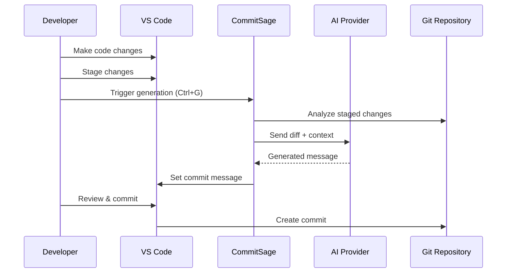

# Usage Guide

This comprehensive guide covers how to effectively use CommitSage for generating AI-powered commit messages, including advanced features, customization options, and best practices.

## Basic Usage

### Generating Commit Messages

CommitSage provides multiple ways to generate commit messages:

#### Method 1: Keyboard Shortcut (Recommended)
1. **Stage your changes** using Git or VS Code source control
2. **Press `Ctrl+G`** (Windows/Linux) or **`Cmd+G`** (Mac)
3. **Wait for AI processing** (progress indicator appears)
4. **Review generated message** in commit input field
5. **Edit if needed** and commit as usual

#### Method 2: Source Control Button
1. **Open Source Control view** (`Ctrl+Shift+G`)
2. **Stage your changes**
3. **Click CommitSage button** in the title bar
4. **Review and commit**

#### Method 3: Command Palette
1. **Open Command Palette** (`Ctrl+Shift+P`)
2. **Type**: "Commit Sage: Generate Commit Message"
3. **Execute command**

### Workflow Integration



## Commit Message Formats

CommitSage supports multiple commit message formats to match your project's conventions:

### Conventional Commits (Default)

**Format**: `type(scope): description`

**Example**:
```
feat(auth): add OAuth2 integration with Google

- Implement OAuth2 flow for Google authentication
- Add user profile retrieval and session management
- Update login UI with Google sign-in button
```

**Configuration**:
```json
{
  "commitSage.commit.commitFormat": "conventional"
}
```

### Angular Format

**Format**: `type(scope): subject` with detailed body

**Example**:
```
feat(core): implement user authentication service

Add comprehensive authentication service with:
- JWT token management
- Automatic token refresh
- Role-based access control

Closes #123
```

### Semantic Format

**Format**: Semantic versioning-aware commits

**Example**:
```
MAJOR: redesign user interface architecture

Breaking changes to component structure:
- Migrate from class to functional components
- Update prop interfaces
- Remove deprecated methods
```

### Emoji Format

**Format**: Emoji prefixes for visual categorization

**Example**:
```
✨ feat: add dark mode toggle

🎨 Improve UI with theme switching capability
🔧 Add theme persistence in localStorage
📱 Ensure mobile responsiveness
```

### Karma Format

**Format**: Simple, action-oriented messages

**Example**:
```
add user profile management

implement profile editing, avatar upload, and preferences
```

## Language Support

CommitSage generates commit messages in multiple languages:

| Language | Code | Example |
|----------|------|----------|
| **English** | `english` | `feat: add user authentication` |
| **Russian** | `russian` | `feat: добавить аутентификацию пользователя` |
| **Chinese** | `chinese` | `feat: 添加用户身份验证` |
| **Japanese** | `japanese` | `feat: ユーザー認証を追加` |
| **Spanish** | `spanish` | `feat: agregar autenticación de usuario` |

**Configuration**:
```json
{
  "commitSage.commit.commitLanguage": "russian"
}
```

## Advanced Features

### Auto-Commit and Auto-Push

Streamline your workflow with automation:

```json
{
  "commitSage.commit.autoCommit": true,
  "commitSage.commit.autoPush": false,
  "commitSage.commit.confirmBeforeCommit": true
}
```

**Workflow with Auto-Commit**:
1. **Stage changes**
2. **Press `Ctrl+G`**
3. **Review generated message** (if confirmation enabled)
4. **Automatic commit** (and optional push)

### Custom Instructions

Tailor commit messages to your project's needs:

```json
{
  "commitSage.commit.customInstructions": "Focus on business impact. Include ticket numbers when available. Mention breaking changes explicitly."
}
```

### Staged vs All Changes

Control which changes are analyzed:

```json
{
  "commitSage.commit.onlyStagedChanges": true
}
```

- **`true`**: Analyze only staged changes (recommended)
- **`false`**: Analyze all modified files

## Project-Specific Configuration

### Creating `.commitsage` Files

Customize CommitSage behavior per project:

1. **Create `.commitsage`** in project root
2. **Add JSON configuration**:

```json
{
  "provider": {
    "type": "gemini"
  },
  "commit": {
    "commitFormat": "conventional",
    "commitLanguage": "english",
    "customInstructions": "Include JIRA ticket numbers. Focus on user-facing changes.",
    "autoCommit": false,
    "onlyStagedChanges": true
  },
  "gemini": {
    "model": "gemini-1.5-flash",
    "temperature": 0.7,
    "maxTokens": 1000
  }
}
```

### Team Configuration

Share configuration across team members:

1. **Commit `.commitsage`** to version control
2. **Document team conventions** in README
3. **Use workspace settings** for shared preferences

## AI Provider Optimization

### Model Selection

Choose appropriate models for your needs:

#### Gemini Models
```json
{
  "commitSage.gemini.model": "gemini-1.5-flash",  // Fast, cost-effective
  "commitSage.gemini.model": "gemini-1.5-pro"     // More detailed, slower
}
```

#### OpenAI Models
```json
{
  "commitSage.openai.model": "gpt-3.5-turbo",     // Fast, economical
  "commitSage.openai.model": "gpt-4",             // Higher quality
  "commitSage.openai.model": "gpt-4-turbo"        // Latest features
}
```

### Temperature and Creativity

Control AI creativity and consistency:

```json
{
  "commitSage.commit.temperature": 0.3,  // Conservative, consistent
  "commitSage.commit.temperature": 0.7,  // Balanced (default)
  "commitSage.commit.temperature": 1.0   // Creative, varied
}
```

### Token Limits

Optimize for cost and performance:

```json
{
  "commitSage.commit.maxTokens": 500,   // Concise messages
  "commitSage.commit.maxTokens": 1000,  // Detailed (default)
  "commitSage.commit.maxTokens": 2000   // Comprehensive
}
```

## Best Practices

### Effective Staging

1. **Stage related changes together**
2. **Separate different features** into different commits
3. **Review staged changes** before generating messages
4. **Use meaningful file names** for better context

### Message Review

1. **Always review generated messages**
2. **Edit for accuracy** and completeness
3. **Add context** that AI might miss
4. **Follow team conventions**

### Configuration Management

1. **Use project-specific settings** for consistency
2. **Document configuration choices**
3. **Share settings** with team members
4. **Version control** `.commitsage` files

## Troubleshooting

### Common Issues

**No message generated:**
- Verify staged changes exist
- Check AI provider configuration
- Review API key validity
- Check internet connection

**Poor message quality:**
- Adjust temperature settings
- Add custom instructions
- Try different AI providers
- Improve change staging

**Performance issues:**
- Reduce max tokens
- Use faster models
- Enable staged-only analysis
- Check network connectivity

### Debug Information

1. **Open Output Panel** (`View > Output`)
2. **Select "Commit Sage"** from dropdown
3. **Review logs** for error details
4. **Enable debug logging** if needed

## Integration Tips

### Git Hooks

Combine with Git hooks for enhanced workflow:

```bash
#!/bin/sh
# pre-commit hook
echo "Running CommitSage validation..."
# Add validation logic
```

### CI/CD Integration

Use consistent commit formats for automated processing:

- **Semantic release** integration
- **Changelog generation**
- **Automated versioning**
- **Deployment triggers**

### IDE Integration

Maximize productivity with VS Code features:

- **Source Control shortcuts**
- **Git lens integration**
- **Workspace settings**
- **Extension combinations**

CommitSage transforms your Git workflow by providing intelligent, contextual commit messages that improve code history and team collaboration.