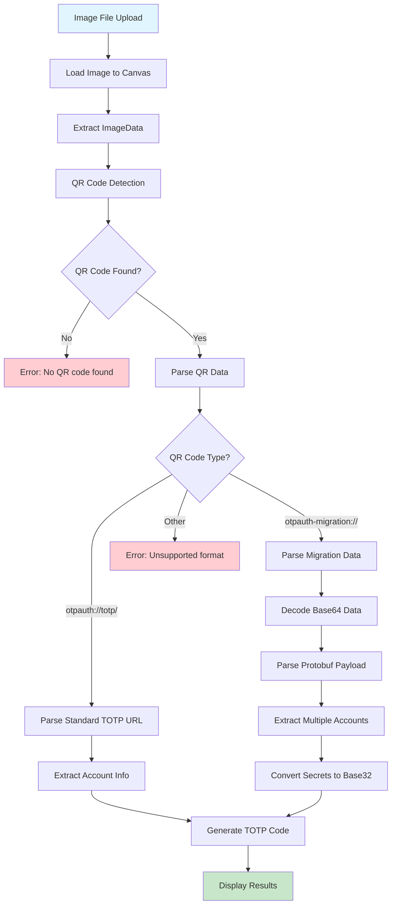

[](https://deepwiki.com/VizzleTF/totp_decoder)

# TOTP QR Code Decoder 

A modern, fully client-side web application for decoding TOTP (Time-based One-Time Password) QR codes from images. Everything runs securely in your browser!

## 🌐 Use it online
### [https://totp-decoder.vercel.app](https://totp-decoder.vercel.app/)

*Or deploy your own copy:* 
[](https://vercel.com/new/clone?repository-url=https://github.com/VizzleTF/TOTP_decoder)

## Features

- 🔐 **Fully Client-Side**: All processing in browser - no data sent to servers
- 📷 **QR Code Decoding**: Decode TOTP QR codes from images and screenshots
- 📱 **Google Authenticator Migration**: Support for migration QR codes (otpauth-migration://)
- ⏰ **Live TOTP Generation**: Generate current TOTP codes in real-time
- 👥 **Multiple Accounts**: Handle multiple accounts from migration QR codes
- 📁 **Drag & Drop**: Simply drag images or paste with Ctrl+V (Cmd+V on Mac)
- 📋 **One-click Copy**: Copy TOTP codes and OTP Auth URLs
- 📱 **Mobile Friendly**: Responsive design for all devices

## Usage

1. **Upload QR code**: Drag & drop image, click to select, or paste with Ctrl+V
2. **View results**: Automatic decoding shows account info, current TOTP codes, and OTP Auth URLs
3. **Copy codes**: Click copy buttons for TOTP codes or URLs
4. **Migration support**: Multiple accounts from Google Authenticator migration QR codes

## Supported Formats

**Images**: PNG, JPG, JPEG, BMP, TIFF, WebP

**QR Codes**:
- `otpauth://totp/` - Standard TOTP format
- `otpauth-migration://` - Google Authenticator migration format
- Parameters: secret, issuer, algorithm (SHA1/SHA256/SHA512), digits (6/8), period

## Project Structure

```
TOTPdecode/
├── web/                    # React web application
│   ├── src/
│   │   ├── App.tsx         # Main React component
│   │   ├── totpDecoder.ts  # Core TOTP decoding logic
│   │   ├── otpMigration.ts # Migration protobuf decoder
│   │   ├── main.tsx        # React entry point
│   │   └── index.css       # Global styles
│   ├── public/
│   │   └── vite.svg        # Vite logo
│   ├── package.json        # Web app dependencies
│   ├── vite.config.js      # Vite configuration
│   ├── tailwind.config.js  # Tailwind CSS config
│   ├── postcss.config.js   # PostCSS config
│   └── index.html          # HTML template
├── package.json            # Root package.json
├── vercel.json             # Deployment config
├── .vercelignore           # Vercel ignore rules
├── test_qr_code.png        # Test QR code image
└── README.md               # Project documentation
```

## Data Processing Flow

The application implements a pipeline architecture for processing QR code images through to TOTP code generation:



## Security Model

The application implements a zero-trust security model where all sensitive operations occur exclusively within the user's browser environment:

```mermaid
flowchart TB
    U[User Image Input]
    
    subgraph Memory["Browser Memory Only"]
        IMG[Image Processing<br/>Canvas API]
        QR[QR Code Decoding<br/>jsQR]
        TOTP[TOTP Generation<br/>totp-generator]
        MEM["🔒 Temporary Memory"]
    end
    
    subgraph Security["Security Guarantees"]
        G1["✅ TOTP secrets never leave browser"]
        G2["✅ No server communication"]
        G3["✅ No persistent storage"]
        G4["✅ Local cryptographic operations"]
    end
    
    U --> IMG
    IMG --> QR
    QR --> TOTP
    TOTP --> MEM
    MEM -.- G1
    MEM -.- G2
    MEM -.- G3
    MEM -.- G4
    
    style Memory stroke:#ff9800,stroke-width:2px
    style Security stroke:#9c27b0,stroke-width:2px
```

